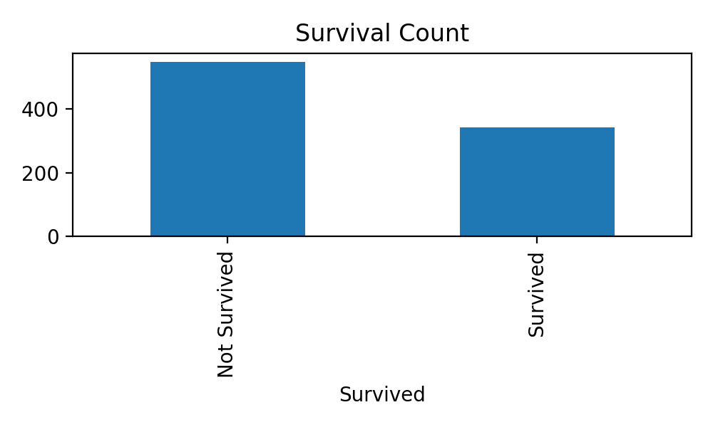
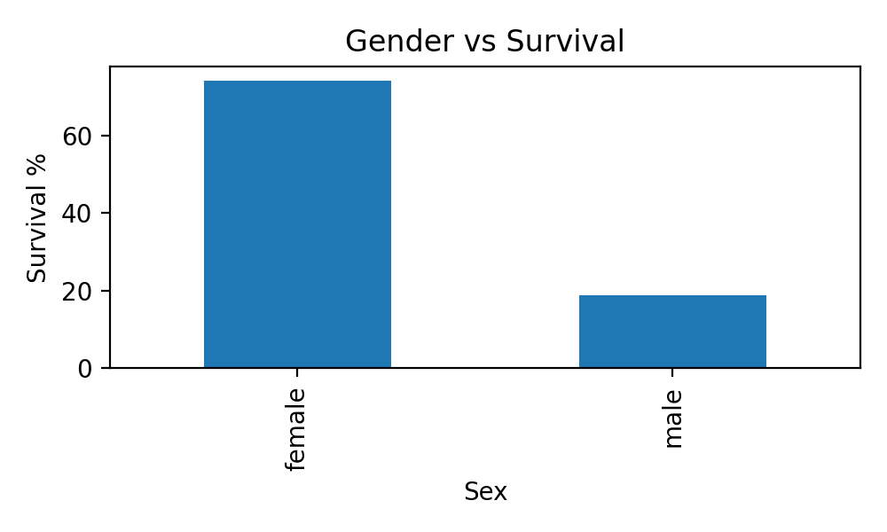
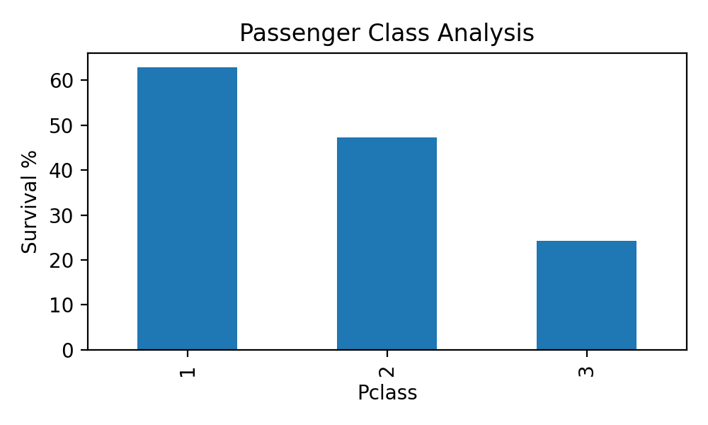
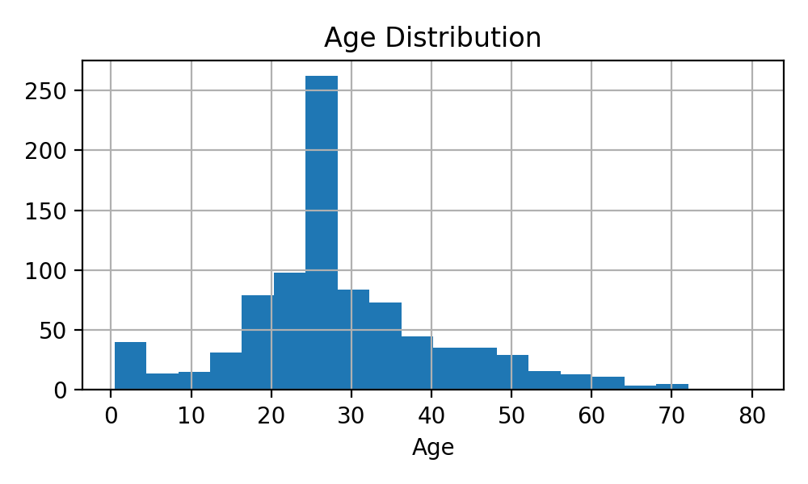
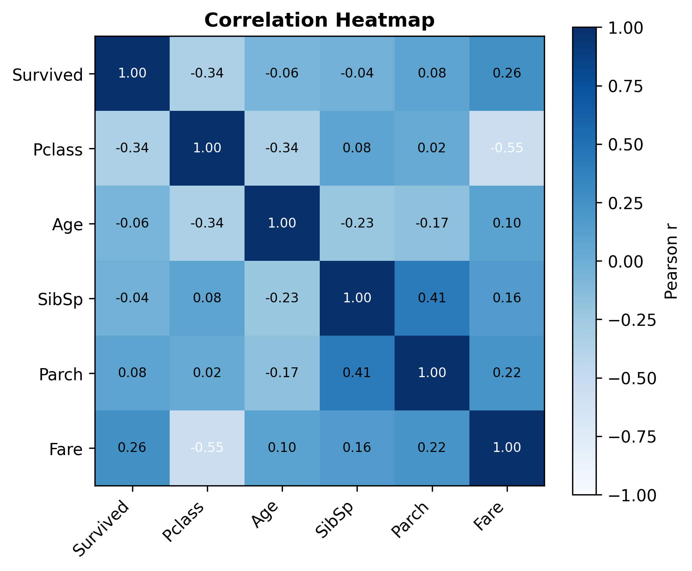

# SWYNEX Task 2 — Exploratory Data Analysis

## Business Problem

An executive team wants to understand which passenger segments were at highest risk during an emergency and which factors most influenced survival. The goal is to transform raw passenger records into decision-ready insights through exploratory analytics.

---

## Business Objective

This project performs Exploratory Data Analysis (EDA) on the cleaned Titanic passenger dataset to identify meaningful trends, statistical relationships, and business insights using Python, Pandas, Matplotlib, and Excel.

---

## Tools & Technologies

- Python
- Pandas
- Matplotlib
- Excel
- GitHub

---

## Dataset Summary

| Metric | Value |
|---------|------:|
| Records | 891 |
| Features | 12 |
| Missing Values After Cleaning | 0 |

---

## Key Insights

### 1. Gender was the strongest predictor
Female passengers had a survival rate of approximately **74%**, significantly higher than males.

### 2. Passenger class influenced survival
First-class passengers showed the highest survival probability, indicating socio-economic impact.

### 3. Children survived more frequently
Passengers under 16 had noticeably better survival outcomes.

### 4. Fare correlated with survival
Higher ticket fares were associated with increased survival probability.

### 5. Embarkation location mattered
Passengers boarding from Cherbourg demonstrated the strongest survival rate.

---

## Repository Structure

```text
data/
reports/
scripts/
visuals/
README.md
```
## Visual Dashboard

### Survival Count


### Gender vs Survival


### Passenger Class Analysis


### Age Distribution


### Correlation Heatmap


---

## Project Outcome

This project demonstrates professional exploratory data analysis, data visualization, statistical interpretation, and business storytelling as part of the SWYNEX Data & AI Internship.
